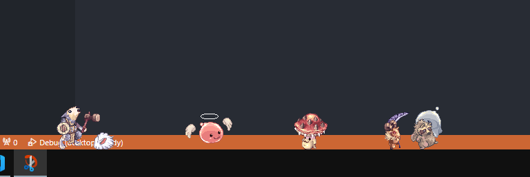

<b>Customizable desktop buddy</b>

#### Instructions
1. Download the latest release [here](https://github.com/gccruz93/desktop-buddy/releases) (v0.2.0).
2. Run the exe.
3. A cfg.ini file will appear in the same folder, configure as you like. Or just right click the tray icon on your taskbar!
4. Configure the mobs.json and assets folder to customize your pets.
5. Enjoy your new pets!

#### Preview

